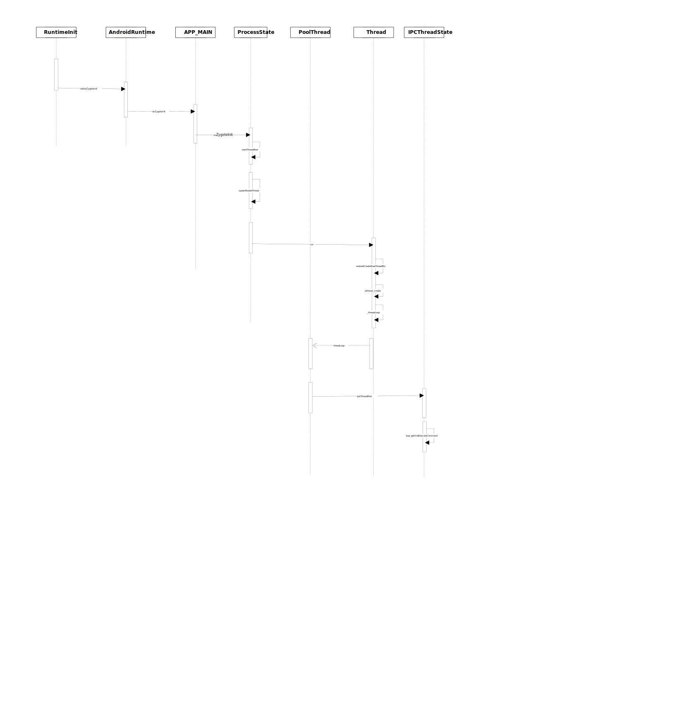

#### Questions: 

Q1: What the difference between Process and Thread ? 
> A1: Process has different memory space but Threads within a process share same memory 

Q2: How Process be created ? 
> A2: fork 

Q3: How Thread be created ? 

A3: When a JVM starts, it will creates a process and a thread in it, which calls the main thread. 
    And it runs immediately. 
    pthread_create 

Q4: How does Thread run code in it ? 

    There is only one thread the main thread, the main static method will be run in it. 

Q5: How does ActivityThread run in thread ? 

    When ActivityThread's main method be invoked, there is an only main thread, it will be run in this thread. 

Q6: How threads communicate with each other ? 

Q7: How Android create thread ? 

    A7:  
